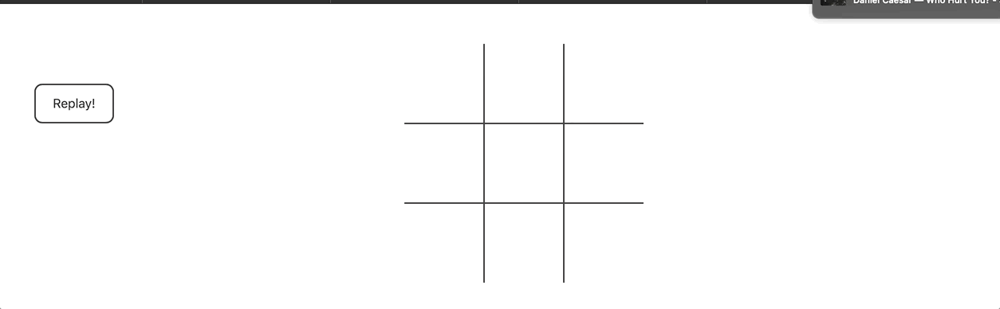

# Tic-Tac-Toe-game
A tic-tac-toe game in which the player play against unbeatable AI.
Built using HTML5, CSS, JavaScript.
Current Functionalities inclue:
- Player plays against an unbeatable AI builtby implementing the Minimax Algorithm.
- Replay button to play the game as many times the player want.

